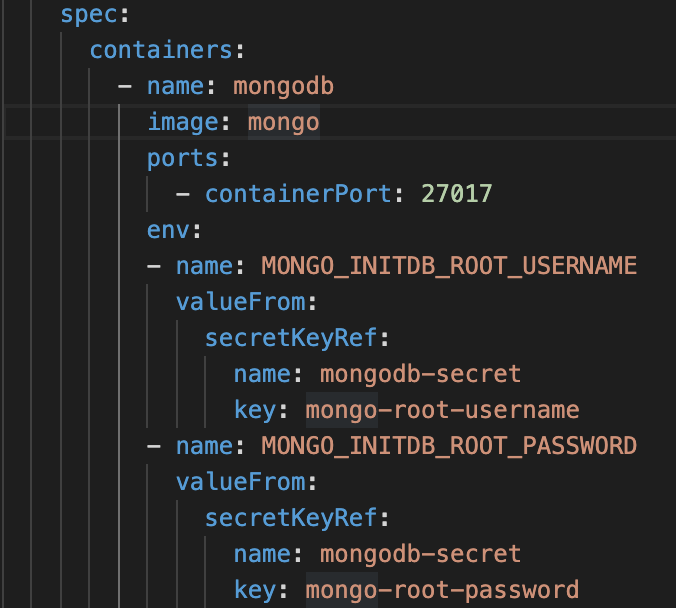
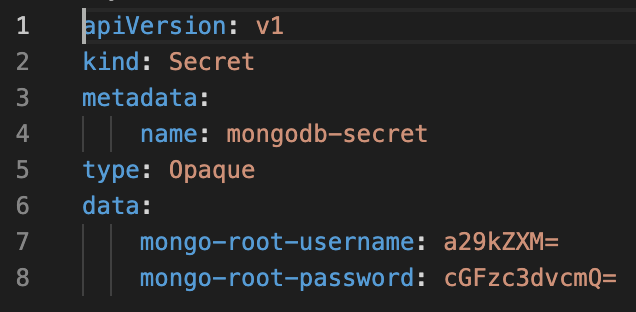
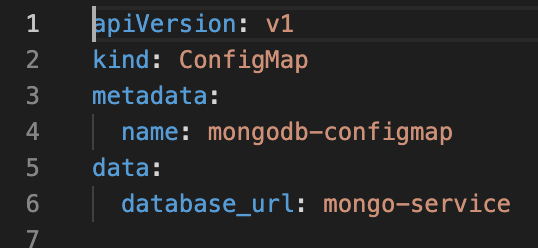

# Database Assignment

### Objectives
**We are going to deploy a secure database within a cluster that we will be able to interact with through a UI**

### Step 1: Creating the Cluster & Configuring the Files

Let's create the cluster. `k3d cluster create db-assign -p "8080:8081@loadbalancer"` Next we are going to configure a series of .yml files that are contained in this repo. Let's go over some of the important points:

1. Firstly, the database is being created on a container in the **Mongo.yaml** file using the `mongo` DockerHub image.



We can see that the container's exposed port is 27017. We can also see that we create two environment variables: a root username and password for the db. We reference mongodb-secret for that information. Let's set up our next file, **Secret.yml**, to contain that information.

2. **Secret.yml** will contain encrypted information on our root username and password.



We see both the referenced `name` and `key` from **Mongo.yaml**, as well as the encrypted values for both the username and password. You will need to create your own encrypted values and input them here by using this command: `echo -n <example_username> | base 64`. Do the same for the password and paste both values in their respective places.

3. Next we have our **mongo_express_deploy.yml**. This builds our UI.

```
apiVersion: apps/v1
kind: Deployment
metadata:
  name: mongoexp-deployment
spec:
  replicas: 1
  selector:
    matchLabels:
      app: mongo-express
  template:
    metadata:
      labels:
        app: mongo-express
    spec:
      containers:
        - name: mongo-express
          image: mongo-express
          ports:
            - containerPort: 8081
          env:
          - name: ME_CONFIG_MONGODB_ADMINUSERNAME
            valueFrom:
              secretKeyRef:
                name: mongodb-secret
                key: mongo-root-username
          - name: ME_CONFIG_MONGODB_ADMINPASSWORD
            valueFrom:
              secretKeyRef:
                name: mongodb-secret
                key: mongo-root-password
          - name: ME_CONFIG_MONGODB_SERVER 
            valueFrom:
              configMapKeyRef:
                name: mongodb-configmap
                key: database_url
---
apiVersion: v1
kind: Service
metadata:
  name: mongo-exp-service
spec:
  selector:
    app: mongo-express
  type: LoadBalancer
  ports:
    - protocol: TCP
      port: 8081
      targetPort: 8081
```

As we can see, our **secret.yml** file is referenced here again. The container for this service will redirect 8081 traffic to its own exposed 8081 port. The container in turn will be able to redirect traffic to our db container using the environmental variable `ME_CONFIG_MONGDB_SERVER`. Within this variable we have referenced yet another file, **config_map.yml**, which we will create next.

4. **config_map.yml** will contain the `key` `database_url`. This will allow our mongo-express service to talk to our mongo-db service, created in **mongo_express_deploy.yml** and **Mongo.yaml**, respecitively.



Here we see the `database_url` value is `mongo-service`, which references the loadbalancer created by the **Mongo.yaml** file, responsible for directing traffic to our database.

### Step 2: Deploying & Validating

Let's deploy our four yml files. The order is important. First we want to deploy our secrets, so that our database and UI can actually use their environment variables. Next we will want to build our database. Thirdly, we will build our map to the database, which is only possible after the database's creation. Finally, our UI, which relies on all three being already deployed to work.

```
kubectl apply -f secret.yml
kubectl apply -f Mongo.yaml
kubectl apply -f config_map.yml
kubectl apply -f mongo_express_deploy.yml
```
After the last command, it will take a couple of minutes before we can access the UI on `localhost:8080`, where we will be able to see the Mongo Express UI.

We can add new databases, new collections and new data and view them in the UI!