# Database Assignment with MongoDB

## 1. Goal:

The goal for this assignment is to deploy an application locally (*local computer is the host*) using **kubernetes**. <br>
The application has a database. The user will interact with the front-end in order to input or read data stored in the database.<br>
The **database** is set up so that the front-end authenticate before accessing the back-end (wich is the database in this case).

## 2. Architecture:

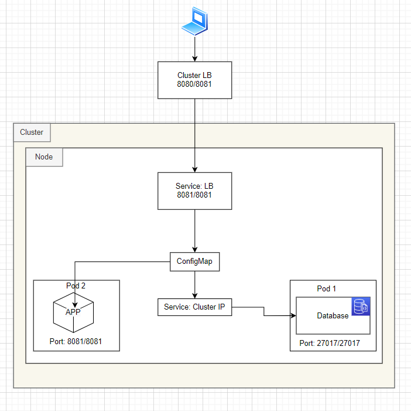

## 3. Software tools used:

* [kubernetes](https://kubernetes.io/)

We avoid using a cloud provider for the deployment for cost purposes.<br>
This is not used in a production environment.

## 4. Precedure:

**Note**: Avoid pasting the `$` sign; it is not part of the commands. The sign shows up when you use **Linux**.

1. Create a cluster with a loadbalancer with port mapping “8080:8081”

```
k3d cluster create mycluster -p "8080:8081@loadbalancer"
```
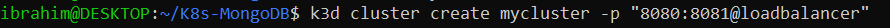

You should see:

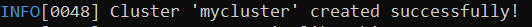

* port `8080` is for the access to the front-end.
* port `8081` is for the access to the application
* port `27017` is the port open in order to access the database
		
2. Encode the username and password and put it in the [secret.yaml](https://github.com/ibrahima1289/k8s-mongoDB/blob/main/secret.yaml) file.<br>
In the command line, type this:
```
$ echo -n mongo-root-username | base64
```
> **Output:** bW9uZ28tcm9vdC11c2VybmFtZQ==

Then, do the same for the password:

```
$ echo -n mongo-root-password | base64
```		

> **Output:** bW9uZ28tcm9vdC1wYXNzd29yZA==

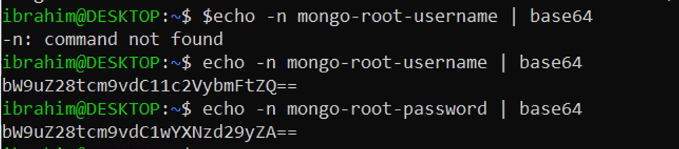

3. Create the `yaml` files in your working directory.

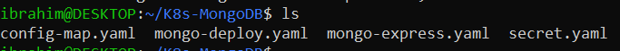

* [secret.yaml](https://github.com/ibrahima1289/k8s-mongoDB/blob/main/secret.yaml) -> this file will authenticate the service for the database credentials.
* [mongo-deploy.yaml](https://github.com/ibrahima1289/k8s-mongoDB/blob/main/mongo-deploy.yaml) -> this will create the deployment for **[mongoDB](https://www.mongodb.com/cloud/atlas/lp/try2?utm_content=rsatest101321_exp_rsaad&utm_source=google&utm_campaign=gs_americas_united_states_search_core_brand_atlas_desktop_rsaexp2&utm_term=mongodb&utm_medium=cpc_paid_search&utm_ad=e&utm_ad_campaign_id=14931263937&adgroup=129255360958&gclid=Cj0KCQjwrJOMBhCZARIsAGEd4VEFbUKfbSSdTlmcri6390GX7AptBIX8T0RQBJ7Rl2536qsEHbAXsnMaAtp3EALw_wcB)** database.
* [config_map.yaml](https://github.com/ibrahima1289/k8s-mongoDB/blob/main/config_map.yaml)    
* [mongo-express.yaml](https://github.com/ibrahima1289/k8s-mongoDB/blob/main/mongo-express.yaml) -> this is for the **[mongo-express](https://www.mongodb.com/languages/express-mongodb-rest-api-tutorial)** deployment.

4. Now, run these commands in the order they are given.<br>

```
$ kubectl apply -f secret.yaml
```
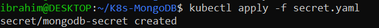


```
$ kubectl apply -f mongo-deploy.yaml
```
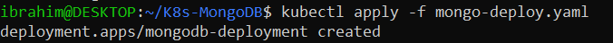


```
$ kubectl apply -f config_map.yaml
```
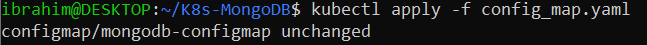


```
$ kubectl apply -f mongo-express.yaml
```
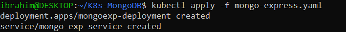

5. Verfy that the pods are running:

```
$ kubectl get pod
```
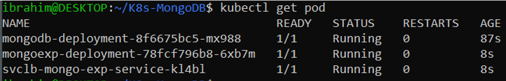

6. Verify that the app is working by typing to the url:

```
localhost:8080
```
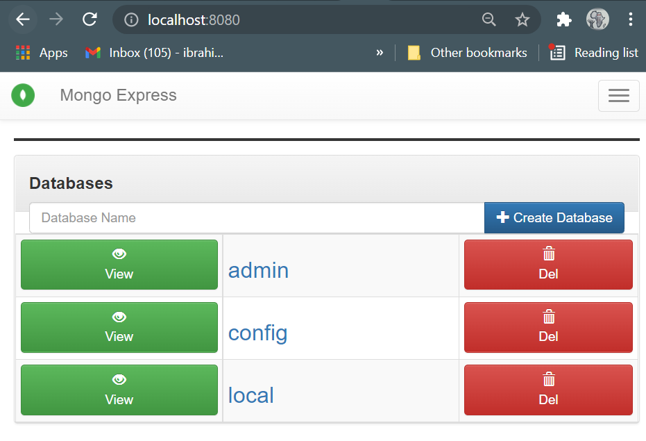

# Source:

* This lab was from [Kura Labs](https://github.com/ibrahima1289/k8s-mongoDB/blob/main/K8s%20and%20MongoDB%20assignment.pdf).
* https://zellwk.com/blog/crud-express-mongodb/

